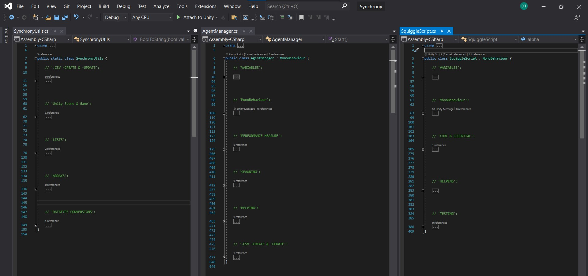

# Achieving _decentralized harmonic synchronization_ in a musical robot collective in Unity
Unity Version: 2021.2.0f1.

This folder contains the Unity project-code for the developed Synchrony-Simulator. It is an image of a full Unity-project, although having some project-files (mostly Unity-generated, binary and large) _.gitignored_.

The following is a high-level overview of the written C# code for the synchronization simulator in Unity. 

First, we have the three main C# scripts _SynchronyUtils.cs_, _AgentManager.cs_, and _SquiggleScript.cs_ with their main clusters of related code labeled in (mostly) all-caps comments:

_SynchronyUtils.cs_ is as you can see a static class, so hence no object of this class is instantiated—but rather instance methods from it are called during the simulation- start up, running, and closing.

_AgentManager.cs_ is not a static class, and is inheriting from _MonoBehaviour_ (implying it implements methods as Start(), Update(), and FixedUpdate() e.g. See Sebastian Lague's great intro to Game Dev in C# and Unity on YouTube to learn more about this). Furthermore, the _AgentManager.cs_ script is attached to a single empty Unity GameObject (which I called the "SquiggleManager") that is always present in the Unity scene. The variables and methods belonging to this class are relevant and applying to all Squiggle robots that are instantiated/spawned at simulation start—and hence here the collective aspects of the musical robot swarm are being manipulated and instantiated.

Over to the more robot-/agent-individual aspects, we come lastly to the _SquiggleScript.cs_ script. Every instantiated/spawned Dr. Squiggle Unity GameObject are attached with the _SquiggleScript.cs_ (again look up Sebastian Lague's intro to GameDev series, especially about Unity Prefabs). Hence, the code in this third robot-individual class is being run for each single GameObject it is being attached to (hence each Dr. Squiggle robot in our case).